# 🎵 TuneSense – Personalized Music Recommendation Platform

[](https://opensource.org/licenses/MIT)
[](https://www.python.org/)
[](https://fastapi.tiangolo.com)
[](https://react.dev)
[](https://vitejs.dev)
[](https://tailwindcss.com)
[](https://scikit-learn.org)
[](https://www.mongodb.com/atlas)

TuneSense is a full-stack, personalized music discovery and streaming platform designed to understand and adapt to each listener's individual taste. Built with React 19, FastAPI, MongoDB Atlas, and scikit-learn, TuneSense bridges the gap between static machine learning demonstrations and commercial music applications. It features secure JWT authentication, interactive taste onboarding, a hybrid content-based recommendation engine (combining TF-IDF semantic metadata with continuous acoustic descriptors and user interaction centroids), real-time listening history telemetry, custom playlist creation, library management, feedback sentiment analysis, and a persistent global audio player that streams verified open Creative Commons and public-domain audio continuously across page navigation.

---

## 🌐 Live Demo

Experience the live, production-deployed TuneSense platform:

[](https://tunesense-frontend.onrender.com/)

* **Frontend Web Application**: [https://tunesense-frontend.onrender.com/](https://tunesense-frontend.onrender.com/)
* **Backend REST API**: [https://tunesense-backend.onrender.com/](https://tunesense-backend.onrender.com/)
* **Interactive API Documentation (Swagger UI)**: [https://tunesense-backend.onrender.com/docs](https://tunesense-backend.onrender.com/docs)
* **GitHub Repository**: [https://github.com/SaiTeja-1605/TuneSense](https://github.com/SaiTeja-1605/TuneSense)

> **Quick Demo Access**: On the login page, click **"Instant 1-Click Demo"** or click **"Fill sample demo credentials"** to instantly explore with pre-configured taste data (`alex@tunesense.io` / `DemoPass123!`).

---

## 📌 Project Overview

### What TuneSense Is
TuneSense (*"Discover music that understands your taste."*) is an end-to-end music discovery and streaming platform. Rather than serving static, one-size-fits-all track lists, TuneSense continuously refines recommendations as listeners play, like, dislike, and explore tracks across genres and moods.

### The Problem It Solves
Modern music catalogs contain tens of millions of songs, creating acute **information overload**. Popular top-charts cater to mainstream demographics, making it difficult for individual listeners to discover tracks matching their specific energy, acoustic texture, or nuanced mood. Furthermore, most recommendation platforms operate as opaque "black boxes" offering zero insight into *why* a song was recommended.

### How TuneSense Solves It
1. **Taste Calibration**: Newly registered listeners complete a 3-step interactive onboarding flow to establish baseline preferences across genres, moods, and acoustic dials (Energy, Danceability, Acousticness, Valence).
2. **Multi-Modal Content Representation**: Tracks are vectorized through a dual representation combining TF-IDF textual metadata with normalized acoustic feature vectors.
3. **Dynamic Interaction Adaptation**: The user's preference vector dynamically shifts toward an interaction centroid calculated from their liked tracks (weighted $2\times$) and recently completed listening events.
4. **Transparent Explainability**: Every recommended track displays a match percentage score ($60\% - 99\%$) accompanied by human-readable rationales explaining the recommendation.
5. **Real Streaming Platform Experience**: Real legal audio playback, a persistent audio player that never stops when browsing routes, playlist management, queue reordering, and personal library hubs.

---

## ✨ Key Features

- **User Authentication & Profiles**:
  - Secure registration, login, and JWT access token lifecycle.
  - Password hashing using industry-standard Bcrypt with salt.
  - 1-click instant demo login and auto-provisioned sample credentials for effortless evaluation.
  - User-specific profile customization with personalized greeting based on local time of day.
- **Taste Calibration Onboarding (`/onboarding`)**:
  - Step 1: Select preferred musical genres (Pop, Rock, Electronic, Lo-Fi, Hip Hop, Jazz, etc.).
  - Step 2: Select go-to emotional states and moods (Upbeat, Chill, Focus, Energetic, Melancholic).
  - Step 3: Calibrate continuous acoustic dials (Energy, Danceability, Acousticness, Valence).
- **Persistent Global Audio Player**:
  - HTML5 Web Audio state machine delivering uninterrupted playback across route navigation.
  - Complete playback controls: Play/Pause, Next/Previous, Seek scrubber with elapsed & total duration (`mm:ss`), Volume slider with mute toggle, Shuffle mode, and 3-state Repeat (`off`, `all`, `one`).
  - Slide-over "Up Next" Queue Drawer with track reordering and one-click queue clearing.
  - "Add to Playlist" modal for instant track assignment or on-the-fly playlist creation.
- **Dynamic Personalized Home Feed (`/home`)**:
  - Time-aware greetings (*"Good evening, Alex"*).
  - Quick Picks 6-tile grid derived from active listening history and taste profile.
  - *Made For You* AI recommendations with match percentages and human-readable explanations.
  - *Because You Liked* recommendation clusters triggered by specific liked tracks.
  - *Mood Stations* (Chill, Energetic, Focus, Euphoric) with one-click full station playback.
  - Trending platform charts, Featured Artists, and Popular Albums.
- **Universal Multi-Entity Search (`/search`)**:
  - Real-time debounced query search spanning Songs, Artists, and Albums simultaneously.
  - Category filter tabs: *All*, *Songs*, *Artists*, *Albums*.
  - Vibrant genre and mood discovery tiles when search input is empty.
- **Catalog Architecture & Artist Discographies**:
  - **Songs**: 120 curated tracks with verified legal streaming audio URLs, album art, and acoustic dimensions.
  - **Artists**: 24 artist profiles with genre pills, biographies, top tracks, and fans-also-like recommendations.
  - **Albums**: 24 full album records with tracklists and runtime calculations.
- **Playlists & Personal Library (`/library`)**:
  - Full playlist CRUD (Create, Read, Update title/description/visibility, Delete).
  - Add or remove individual songs from playlists.
  - Dedicated Liked Songs hub (`/library/liked`) with one-click track removal and playback.
- **Real-Time Listening History**:
  - Telemetry logger records listening events when a track plays for $\ge 30$ seconds or completes.
  - Chronological recently played track feed with one-click history clearing.
- **Interactive Visual Analytics (`/analytics`)**:
  - Real-time interactive charts built with Recharts:
    - User Acoustic Fingerprint Radar (Energy, Danceability, Valence, Acousticness).
    - Top Genre Affinity breakdown.
    - Mood Distribution breakdown.
    - Feedback Sentiment statistics (Likes vs Dislikes).
    - Listening activity timeline.
- **Multi-User Data Isolation**:
  - Strict document isolation in MongoDB Atlas ensuring zero cross-user data leakage.
- **Resilient Error Handling**:
  - Global React Error Boundary with user-friendly recovery UI to prevent white-screen crashes.
  - Proactive background backend warmup ping on landing to mitigate free-tier cold-start latency.

---

## 🎯 Problem Statement

In the era of streaming platforms hosting over 100 million songs, music consumers face severe choice paralysis:
1. **Catalog Overload**: Finding music tailored to a specific task (deep focus, high-intensity workouts, late-night study) requires tedious manual searching.
2. **Static & Impersonal Curation**: Standard editorial playlists remain static and unpersonalized, ignoring an individual listener's historical engagement.
3. **Opaque Recommendations**: Users often do not understand why algorithmic platforms serve particular songs, reducing trust and user agency.
4. **Portfolio Disconnect**: Most machine learning portfolio projects are isolated Jupyter notebooks or command-line scripts lacking real-time audio playback, stateful user interfaces, authentication, or scalable cloud databases.

TuneSense resolves these challenges by uniting an explainable machine learning recommendation engine with a production-grade full-stack music streaming architecture.

---

## 💡 Solution

TuneSense addresses music discovery through an end-to-end data pipeline:

```
┌──────────────┐     ┌──────────────┐     ┌──────────────┐     ┌──────────────┐
│  User Taste  │ ──> │ Listen / Play│ ──> │ Like/Dislike │ ──> │ Interaction  │
│  Onboarding  │     │  Telemetry   │     │   Feedback   │     │   Centroid   │
└──────────────┘     └──────────────┘     └──────────────┘     └──────────────┘
                                                                       │
                                                                       ▼
┌──────────────┐     ┌──────────────┐     ┌──────────────┐     ┌──────────────┐
│ Personalized │ <── │ Explainable  │ <── │ Cosine Rank  │ <── │ Multi-Modal  │
│  Home Feed   │     │  Rationale   │     │  & Filtering │     │ Feature Math │
└──────────────┘     └──────────────┘     └──────────────┘     └──────────────┘
```

1. **Taste Initialization**: Upon sign-up, the user selects preferred genres, moods, and acoustic targets, establishing an initial profile vector.
2. **Interaction Telemetry**: As the user listens to music, the persistent player records play duration, completions, likes, and dislikes.
3. **Dynamic Vector Centroid**: The engine blends the baseline profile with an interaction centroid derived from recent listening history and liked tracks (weighted $2\times$).
4. **Vector Similarity Ranking**: The engine executes cosine similarity scoring against the catalog, filters out disliked tracks, normalizes match percentages, and attaches explainable rationales.
5. **Continuous Feedback Loop**: Each subsequent interaction refines future recommendations in real time.

---

## 🤖 Recommendation System

TuneSense uses a multi-modal **Content-Based Vector Space Model** implemented in Python using scikit-learn, NumPy, and pandas:

```
User Stated Preferences (Genres, Moods, Acoustic Targets)
                           ↓
Liked Tracks (Weight: 2x) & Listening History (Weight: 1x)
                           ↓
              Dynamic User Taste Vector: u
                           ↓
     ┌───────────────────────────────────────────┐
     │ 65% TF-IDF Metadata + 35% Acoustic Vector │
     └───────────────────────────────────────────┘
                           ↓
             Cosine Similarity Computation:
              Sim(u, s) = (u · v(s)) / (||u|| * ||v(s)||)
                           ↓
             Strict Dislike Exclusion Filter:
                   Filter out s ∈ Disliked
                           ↓
             Scaled Match Score & Explainability:
               Score = round(60 + Sim * 39)%
                           ↓
        Final Ranked Recommendations (Made For You)
```

### 1. Text Semantic Vectorization (TF-IDF)
For every song in the catalog, a compound textual metadata document is formed with domain-specific feature weighting:
$$\text{Doc}(s) = (\text{Genre} \times 2) + (\text{Mood} \times 2) + (\text{Tags} \times 2) + \text{Artist} + \text{Language} + \text{Description}$$

A `TfidfVectorizer` (with `ngram_range=(1, 2)` and sublinear term frequency scaling) converts the catalog into a sparse document-term matrix, which is then $L_2$-normalized:
$$\mathbf{v}_{\text{text}}(s) = \frac{\mathbf{t}(s)}{\|\mathbf{t}(s)\|_2}$$

### 2. Continuous Acoustic Feature Vectorization
Continuous acoustic features are extracted, scaled, and normalized:
$$\mathbf{v}_{\text{audio}}(s) = \left[\frac{\text{tempo} - 60}{120},\, \text{energy},\, \text{danceability},\, \text{acousticness},\, \text{instrumentalness},\, \text{valence}\right]$$
$$\mathbf{v}_{\text{audio}}(s) = \frac{\mathbf{v}_{\text{audio}}(s)}{\|\mathbf{v}_{\text{audio}}(s)\|_2}$$

### 3. Multi-Modal Feature Concatenation
The final representation combines text semantics and acoustic dimensions via weighted concatenation:
$$\mathbf{v}_{\text{combined}}(s) = \frac{\left[0.65 \cdot \mathbf{v}_{\text{text}}(s) \;\|\; 0.35 \cdot \mathbf{v}_{\text{audio}}(s)\right]}{\|\left[0.65 \cdot \mathbf{v}_{\text{text}}(s) \;\|\; 0.35 \cdot \mathbf{v}_{\text{audio}}(s)\right]\|_2}$$

### 4. Dynamic User Vector & Interaction Centroid Blending
The user vector $\mathbf{u}$ is not static. It adapts as the listener engages with the application:
$$\mathbf{u}_{\text{refined}} = 0.55 \cdot \mathbf{u}_{\text{profile}} + 0.45 \cdot \left(\frac{2 \cdot \sum_{l \in L}\mathbf{v}_{\text{combined}}(l) + \sum_{h \in H}\mathbf{v}_{\text{combined}}(h)}{2|L| + |H|}\right)$$
where $L$ is the set of user-liked tracks and $H$ is the set of recently listened tracks.

### 5. Cosine Similarity & Dislike Filtering
Cosine similarity is calculated via dot product against the candidate catalog:
$$\text{Sim}(\mathbf{u}, s) = \mathbf{u} \cdot \mathbf{v}_{\text{combined}}(s)$$
Any track explicitly disliked by the user ($s \in D$) is strictly filtered out.

### 6. Transparent Explainability
The explainability module ([explainer.py](file:///c:/Users/saite/OneDrive/文档/TuneSense/backend/app/ml/explainer.py)) evaluates dominant feature alignments to generate plain-English rationales such as:
* *"Matches your high-energy electronic preferences with upbeat rhythm"*
* *"Similar to your liked song 'Midnight Echoes' by Solar Echo"*
* *"Recommended based on your focus mood and acoustic balance"*

---

## 🏗️ System Architecture

```mermaid
graph TD
    subgraph Client ["Frontend (React 19 + Vite + Tailwind CSS v4)"]
        UI[Responsive Views & Navigation]
        Player[Persistent Global Music Player]
        Queue[Queue Drawer & State]
        ContextAuth[AuthContext & JWT Storage]
        ContextPlayer[PlayerContext & Web Audio]
        ErrorBoundary[Global Error Boundary]
    end

    subgraph CDN ["Legal Audio Streams"]
        AudioSource["Open Creative Commons / Archive.org Audio"]
    end

    subgraph Server ["Backend (FastAPI REST Services)"]
        AuthService["Auth Router (/api/auth)"]
        HomeService["Home Feed Router (/api/home)"]
        SongService["Songs & Search Router (/api/songs)"]
        ArtistService["Artists Router (/api/artists)"]
        AlbumService["Albums Router (/api/albums)"]
        PlaylistService["Playlists Router (/api/playlists)"]
        LibService["Library Router (/api/library)"]
        RecService["Recommendations Router (/api/recommendations)"]
        HistoryService["History Router (/api/history)"]
        AnalyticsService["Analytics Router (/api/analytics)"]
        
        subgraph MLEngine ["ML Recommender Engine"]
            TFIDF["TF-IDF Vectorizer (N-grams)"]
            Scaler["Acoustic Normalizer"]
            Centroid["Interaction Centroid Blender"]
            Cosine["Cosine Similarity Ranker"]
            Explainer["Explainability Engine"]
        end
    end

    subgraph Storage ["Database (MongoDB Atlas)"]
        ColUsers[("users")]
        ColPrefs[("user_preferences")]
        ColSongs[("songs")]
        ColArtists[("artists")]
        ColAlbums[("albums")]
        ColPlaylists[("playlists")]
        ColLiked[("liked_songs")]
        ColHistory[("listening_history")]
        ColFeedback[("feedback")]
        ColRecHistory[("recommendation_history")]
    end

    UI --> ContextAuth
    UI --> ContextPlayer
    ContextPlayer --> Player
    Player --> AudioSource
    Player --> HistoryService
    
    ContextAuth --> AuthService
    UI --> HomeService
    UI --> SongService
    UI --> ArtistService
    UI --> AlbumService
    UI --> PlaylistService
    UI --> LibService
    UI --> RecService
    UI --> HistoryService
    UI --> AnalyticsService

    HomeService --> MLEngine
    RecService --> MLEngine
    
    AuthService --> ColUsers
    AuthService --> ColPrefs
    SongService --> ColSongs
    SongService --> ColLiked
    ArtistService --> ColArtists
    AlbumService --> ColAlbums
    PlaylistService --> ColPlaylists
    LibService --> ColLiked
    LibService --> ColPlaylists
    HistoryService --> ColHistory
    RecService --> ColFeedback
    RecService --> ColRecHistory
    AnalyticsService --> ColHistory
    AnalyticsService --> ColFeedback
```



---

## 🛠️ Technology Stack

| Layer | Technology | Version | Purpose |
|---|---|---|---|
| **Frontend Framework** | **React** | 19.2.8 | Declarative component UI and reactive state management |
| **Build Tool** | **Vite** | 8.3.0 | Modern ES-module development and optimized production bundling |
| **Styling & Design** | **Tailwind CSS** | 4.3.3 | Utility-first responsive dark theme and glassmorphic aesthetics |
| **Routing** | **React Router** | 7.18.4 | Client-side routing, protected route guards, and URL navigation |
| **Data Visualizations** | **Recharts** | 3.10.1 | Interactive radar, bar, and pie charts for taste analytics |
| **Icons** | **Lucide React** | 1.47.0 | Modern SVG iconography across player, sidebar, and controls |
| **HTTP Client** | **Axios** | 1.20.0 | Promise-based API requests with automatic JWT interceptors |
| **Backend Framework** | **FastAPI** | 0.111.0 | High-performance asynchronous Python web framework |
| **Data Validation** | **Pydantic** | 2.7.0+ | Strict request/response data validation and schema enforcement |
| **ASGI Server** | **Uvicorn** | 0.30.0+ | Production asynchronous server running FastAPI |
| **Machine Learning** | **scikit-learn** | 1.4.0+ | TF-IDF vectorization, feature scaling, and cosine similarity |
| **Numerical Computing** | **NumPy** & **pandas** | 1.26+ / 2.2+ | Matrix operations, feature fusion, and tabular catalog manipulations |
| **Database** | **MongoDB Atlas** | Cloud v7.0+ | NoSQL document database for scalable multi-entity storage |
| **Async DB Driver** | **Motor** & **PyMongo** | 3.4.0+ / 4.7.0+ | Non-blocking asynchronous MongoDB client for Python |
| **Authentication** | **PyJWT** | 2.8.0 | JSON Web Token encoding, signing, and verification |
| **Password Security** | **Passlib** & **Bcrypt** | 1.7.4 / 4.0.1 | One-way salted password hashing |
| **Testing** | **Pytest** & **HTTPX** | 8.0+ / 0.27+ | Automated unit, security, ML, and integration test suite |
| **Deployment Platform**| **Render** | Cloud Native | Managed Web Service (FastAPI) and Static Site (React Vite) |

---

## 🔐 Authentication & Security

TuneSense enforces modern web application security practices:

1. **Stateless JWT Authentication**:
   - On successful login, the server issues a signed JSON Web Token (`HS256`) containing the user's unique identity.
   - The token is securely verified on every authenticated request via FastAPI dependency injection (`get_current_user`).
2. **Salted Password Hashing**:
   - Plaintext passwords are never saved. All passwords are encrypted with individual cryptographic salts using Bcrypt before storage.
3. **Protected Client Routes**:
   - Client-side `<ProtectedRoute>` components guard private routes (`/home`, `/library`, `/playlists`, `/discover`, `/preferences`, `/history`, `/analytics`). Unauthenticated visitors are redirected to `/login`.
4. **Automated Session Invalidation**:
   - Axios response interceptors monitor API responses. If an active session encounters an HTTP 401 Unauthorized status, the expired token is automatically evicted from `localStorage`.
5. **Cross-Origin Resource Sharing (CORS)**:
   - Configured with explicit origin regex filtering (`allow_origin_regex=r"^https?://.*"`) and `allow_credentials=True` to satisfy modern browser fetch credential standards without open wildcard vulnerabilities.
6. **Zero Committed Secrets**:
   - Secrets (`MONGODB_URI`, `JWT_SECRET`) are strictly loaded via `.env` files and environment variables, with zero credentials committed to GitHub.

---

## 👤 Multi-User Data Isolation

TuneSense is architected for concurrent, isolated multi-user operation:
* **Account Partitioning**: Every database record in `user_preferences`, `playlists`, `liked_songs`, `listening_history`, `feedback`, and `recommendation_history` is indexed and filtered by the authenticated user's `user_id`.
* **Private Recommendations**: User A's listening history, likes, and feedback have zero influence on User B's recommendation feed.
* **Private Playlists & Libraries**: Playlists and liked tracks are private to the creator (unless explicitly marked as public by the owner).
* **Isolated Analytics**: Telemetry graphs visualize only the personal statistics of the currently logged-in account.

---

## 🎵 Music Features

### 1. Music Discovery
* **Universal Search**: Multi-entity instant search query returns grouped results for matching Songs, Artists, and Albums with debounce.
* **Made For You**: Algorithmically tailored track list with match scores ($60\% - 99\%$) and clear human-readable explanations.
* **Because You Liked**: Song-cluster carousels dynamically triggered by tracks the user has liked.
* **Mood Stations**: Curated acoustic stations (Chill, Energetic, Focus, Euphoric) that load and play seamless continuous mixes.
* **Genre & Mood Explore Tiles**: Interactive discovery categories across 12 genres and 8 distinct moods.
* **Catalog Browser**: Paginated catalog of 120 tracks with genre, mood, and language filter dropdowns.

### 2. Persistent Music Player
* **Seamless Playback**: Audio continues playing without stopping or stuttering while navigating between pages.
* **Standard Audio Controls**: Play, Pause, Previous Track, Next Track.
* **Scrubber & Progress**: Interactive seek bar showing current elapsed time and total duration (`mm:ss`).
* **Volume Controls**: Smooth volume slider with one-click instant mute toggle.
* **Playback Modes**: Shuffle toggle and 3-state Repeat toggle (`Off` $\to$ `Repeat All` $\to$ `Repeat One`).
* **Queue Drawer**: Slide-over drawer displaying the current active track, upcoming play queue, track deletion, and clear queue button.
* **Playlist Assignment**: Modal trigger to add the currently playing song to any user playlist with 1 click.

### 3. Library Hub
* **Liked Songs**: Dedicated collection of all favorited tracks with one-click play all and individual un-liking.
* **Playlists Manager**: Create, view, edit title/description, update visibility (public/private), and delete playlists.
* **Recently Played**: Chronologically sorted listening history log displaying play timestamps and duration.

---

## 📊 Analytics

TuneSense provides listeners with transparent data visualizations regarding their musical preferences and algorithmic interactions:

| Metric / Visualization | Type | Description |
|---|---|---|
| **Acoustic Fingerprint** | Radar Chart | Visualizes personal targets across Energy, Danceability, Valence, and Acousticness |
| **Top Genre Affinity** | Bar Chart | Measures the distribution of genres across recommended and played tracks |
| **Mood Breakdown** | Donut Chart | Proportional breakdown of mood classifications across the user's catalog |
| **Feedback Sentiment** | Pie Chart | Ratio of tracks marked with "Like" vs "Dislike" feedback |
| **Telemetry Summary** | Stat Cards | Tracks Recommended, Songs Liked, Top Genre Affinity, and Average Match Score |

---

## 🗄️ Database

TuneSense utilizes **MongoDB Atlas** for document storage (with a built-in asynchronous in-memory database fallback for local offline testing):

| Collection | Purpose | Key Attributes |
|---|---|---|
| **`users`** | Registered user accounts | `_id`, `name`, `email`, `password_hash`, `created_at` |
| **`user_preferences`** | Acoustic taste targets | `user_id`, `favorite_genres`, `favorite_moods`, `languages`, `energy`, `danceability`, `acousticness`, `valence`, `updated_at` |
| **`songs`** | Music catalog (120 tracks) | `song_id`, `title`, `artist`, `artist_id`, `album`, `album_id`, `album_art`, `genre`, `mood`, `language`, `duration`, `popularity`, `audio_url`, `tags`, `energy`, `danceability`, `acousticness`, `instrumentalness`, `valence`, `tempo` |
| **`artists`** | Curated artists (24 records) | `artist_id`, `name`, `image`, `genres`, `bio`, `popularity` |
| **`albums`** | Curated albums (24 records) | `album_id`, `title`, `artist`, `artist_id`, `cover`, `release_date`, `genre`, `songs` |
| **`playlists`** | User-created playlists | `_id`, `user_id`, `title`, `description`, `cover`, `is_public`, `songs`, `created_at`, `updated_at` |
| **`liked_songs`** | User favorites | `_id`, `user_id`, `song_id`, `created_at` |
| **`listening_history`**| Play telemetry events | `_id`, `user_id`, `song_id`, `duration_listened`, `completed`, `listened_at` |
| **`feedback`** | Like/Dislike ratings | `_id`, `user_id`, `song_id`, `feedback` ("like"/"dislike"), `created_at` |
| **`recommendation_history`** | Generated recommendation log | `_id`, `user_id`, `song_id`, `recommendation_score`, `reason`, `feedback`, `created_at` |

---

## 🔌 API Reference

### Authentication (`/api/auth`)
| Method | Endpoint | Purpose | Authentication |
|---|---|---|---|
| `POST` | `/api/auth/register` | Register a new user account & initialize default preferences | Public |
| `POST` | `/api/auth/login` | Authenticate with email/password and obtain JWT access token | Public |
| `POST` | `/api/auth/demo` | Instant 1-click authentication for pre-seeded demo user | Public |
| `GET` | `/api/auth/me` | Fetch authenticated user profile data | Bearer Token |

### Home & Personal Feed (`/api/home`)
| Method | Endpoint | Purpose | Authentication |
|---|---|---|---|
| `GET` | `/api/home` | Aggregated feed (Quick Picks, Made For You, Because You Liked, Mood Mixes, Trending, Albums) | Bearer Token |

### Songs & Search (`/api/songs`)
| Method | Endpoint | Purpose | Authentication |
|---|---|---|---|
| `GET` | `/api/songs` | List songs with pagination and filtering by genre, mood, language, search | Public |
| `GET` | `/api/songs/search` | Multi-entity fuzzy search across songs, artists, and albums | Public |
| `GET` | `/api/songs/{id}` | Retrieve song detail and content-similar recommendations | Public |
| `POST` | `/api/songs/{id}/like` | Add song to authenticated user's liked collection | Bearer Token |
| `DELETE` | `/api/songs/{id}/like` | Remove song from authenticated user's liked collection | Bearer Token |
| `GET` | `/api/songs/{id}/liked` | Check if a specific song is liked by the current user | Bearer Token |

### Artists & Discography (`/api/artists`)
| Method | Endpoint | Purpose | Authentication |
|---|---|---|---|
| `GET` | `/api/artists` | List all artists with optional genre filtering | Public |
| `GET` | `/api/artists/{id}` | Get artist profile, top songs, discography albums, and related artists | Public |

### Albums (`/api/albums`)
| Method | Endpoint | Purpose | Authentication |
|---|---|---|---|
| `GET` | `/api/albums` | List all albums with optional genre filtering | Public |
| `GET` | `/api/albums/{id}` | Get album detail, cover, artist metadata, and full tracklist | Public |

### Playlists (`/api/playlists`)
| Method | Endpoint | Purpose | Authentication |
|---|---|---|---|
| `GET` | `/api/playlists` | Retrieve all playlists created by the current user | Bearer Token |
| `POST` | `/api/playlists` | Create a new user playlist | Bearer Token |
| `GET` | `/api/playlists/{id}` | Get playlist details with fully hydrated song items | Bearer Token |
| `PUT` | `/api/playlists/{id}` | Update playlist title, description, cover image, or public visibility | Bearer Token |
| `DELETE` | `/api/playlists/{id}` | Delete a user playlist | Bearer Token |
| `POST` | `/api/playlists/{id}/songs` | Add a track to an existing playlist | Bearer Token |
| `DELETE` | `/api/playlists/{id}/songs/{song_id}` | Remove a track from an existing playlist | Bearer Token |

### Library (`/api/library`)
| Method | Endpoint | Purpose | Authentication |
|---|---|---|---|
| `GET` | `/api/library` | Aggregated counts of user's liked songs, playlists, and history | Bearer Token |
| `GET` | `/api/library/liked` | Retrieve the complete tracklist of user's liked songs | Bearer Token |

### Recommendations (`/api/recommendations`)
| Method | Endpoint | Purpose | Authentication |
|---|---|---|---|
| `GET` | `/api/recommendations` | Generate personalized recommendations with match scores and rationales | Bearer Token |
| `POST` | `/api/recommendations/feedback` | Submit explicit user feedback (`like` / `dislike` / `none`) for a song | Bearer Token |

### Preferences (`/api/preferences`)
| Method | Endpoint | Purpose | Authentication |
|---|---|---|---|
| `GET` | `/api/preferences` | Retrieve user's calibrated genre, mood, and acoustic targets | Bearer Token |
| `PUT` | `/api/preferences` | Update acoustic sliders and preferred genres/moods | Bearer Token |

### History (`/api/history`)
| Method | Endpoint | Purpose | Authentication |
|---|---|---|---|
| `GET` | `/api/history` | Retrieve user's recommendation history log | Bearer Token |
| `POST` | `/api/history` | Record a real-time listening playback event | Bearer Token |
| `GET` | `/api/history/recently-played` | Chronological list of user's recently streamed tracks | Bearer Token |
| `DELETE` | `/api/history/{id}` | Delete a specific listening history entry | Bearer Token |
| `DELETE` | `/api/history` | Clear entire listening history for the current user | Bearer Token |

### Analytics & System Health
| Method | Endpoint | Purpose | Authentication |
|---|---|---|---|
| `GET` | `/api/analytics` | Compute and aggregate user telemetry for chart visualizations | Bearer Token |
| `GET` | `/` | Root service health check and ML model readiness status | Public |
| `GET` | `/api/health` | Diagnostic status, database connection mode, and indexed track count | Public |

---

## 📁 Project Structure

```
TuneSense/
├── backend/                              # FastAPI Python Backend Service
│   ├── app/
│   │   ├── auth/                         # Authentication & Security
│   │   │   ├── jwt.py                    # JWT token creation, decoding & dependencies
│   │   │   └── security.py               # Bcrypt password hashing & validation
│   │   ├── database/                     # Database layer
│   │   │   ├── connection.py             # Async Motor client & in-memory async fallback
│   │   │   ├── generate_dataset.py       # Catalog generator for songs, artists, albums
│   │   │   └── seed.py                   # Automatic database seeding & demo user provisioning
│   │   ├── ml/                           # Machine Learning Engine
│   │   │   ├── explainer.py              # Contextual recommendation explanation generator
│   │   │   └── recommender.py            # Hybrid TF-IDF & acoustic content-based ranker
│   │   ├── models/                       # Pydantic v2 schemas
│   │   │   ├── album.py                  # Album schemas
│   │   │   ├── analytics.py              # Telemetry & visualization schemas
│   │   │   ├── artist.py                 # Artist schemas
│   │   │   ├── feedback.py               # Feedback schemas
│   │   │   ├── history.py                # Listening history schemas
│   │   │   ├── home.py                   # Home feed schemas (MadeForYou, BecauseYouLiked)
│   │   │   ├── library.py                # Library summary schemas
│   │   │   ├── playlist.py               # Playlist schemas
│   │   │   ├── preference.py             # User acoustic preference schemas
│   │   │   ├── song.py                   # Song & search schemas
│   │   │   └── user.py                   # Authentication schemas
│   │   ├── routes/                       # REST API Route Controllers
│   │   │   ├── albums.py                 # Album endpoints
│   │   │   ├── analytics.py              # Visual analytics endpoints
│   │   │   ├── artists.py                # Artist profile endpoints
│   │   │   ├── auth.py                   # Login, register, demo endpoints
│   │   │   ├── history.py                # Listening history endpoints
│   │   │   ├── home.py                   # Tailored home feed endpoint
│   │   │   ├── library.py                # Library and liked tracks endpoints
│   │   │   ├── playlists.py              # Playlist CRUD endpoints
│   │   │   ├── preferences.py            # Preference management endpoints
│   │   │   ├── recommendations.py        # ML recommendation & feedback endpoints
│   │   │   └── songs.py                  # Catalog & search endpoints
│   │   ├── config.py                     # Pydantic BaseSettings & environment configs
│   │   └── main.py                       # FastAPI entry point, lifespan, CORS setup
│   ├── data/                             # Backend seed datasets (songs, artists, albums)
│   ├── tests/                            # Automated test suite
│   │   ├── test_api.py                   # End-to-end API integration tests
│   │   ├── test_auth.py                  # Password hashing & JWT lifecycle tests
│   │   └── test_ml.py                    # ML model fitting, ranking & explanation tests
│   └── requirements.txt                  # Python dependencies
│
├── frontend/                             # React 19 + Vite Frontend Application
│   ├── src/
│   │   ├── api/                          # HTTP client service layer
│   │   │   ├── client.js                 # Axios instance with baseURL fallback & 401 handling
│   │   │   └── index.js                  # Modular API request functions
│   │   ├── components/                   # Reusable UI Components
│   │   │   ├── AddToPlaylistModal.jsx    # Modal for adding tracks to playlists
│   │   │   ├── AudioFeaturesBar.jsx      # Visual acoustic feature meters
│   │   │   ├── ErrorBoundary.jsx         # Global error boundary recovery UI
│   │   │   ├── Navbar.jsx                # Header navigation dock
│   │   │   ├── PlayerBar.jsx             # Persistent bottom music player dock
│   │   │   ├── ProtectedRoute.jsx        # JWT route guard
│   │   │   ├── QueueDrawer.jsx           # Slide-over play queue drawer
│   │   │   ├── Sidebar.jsx               # Responsive side navigation
│   │   │   ├── SongCard.jsx              # Track card with audio preview & feedback controls
│   │   │   ├── StatCard.jsx              # Metric indicator cards
│   │   │   ├── Toast.jsx                 # User notification alerts
│   │   │   └── TrackRow.jsx              # Table row format for tracklists
│   │   ├── context/                      # Global React State Contexts
│   │   │   ├── AuthContext.jsx           # User authentication & token state
│   │   │   └── PlayerContext.jsx         # Persistent HTML5 Web Audio state engine
│   │   ├── layouts/
│   │   │   └── AppLayout.jsx             # Shell layout with persistent player and sidebar
│   │   ├── pages/                        # Application Route Pages
│   │   │   ├── AlbumPage.jsx             # Album view & tracklist
│   │   │   ├── AnalyticsPage.jsx         # Visual analytics & taste radar
│   │   │   ├── ArtistPage.jsx            # Artist profile & discography
│   │   │   ├── CatalogPage.jsx           # 120-track catalog explorer
│   │   │   ├── DashboardPage.jsx         # Legacy dashboard view
│   │   │   ├── DiscoverPage.jsx          # AI discover & interactive filtering
│   │   │   ├── HistoryPage.jsx           # Listening history log
│   │   │   ├── HomePage.jsx              # Main streaming home feed
│   │   │   ├── LandingPage.jsx           # Public landing view
│   │   │   ├── LibraryPage.jsx           # Personal library hub
│   │   │   ├── LikedSongsPage.jsx        # Favorited tracks hero view
│   │   │   ├── LoginPage.jsx             # Login with 1-click demo access
│   │   │   ├── OnboardingPage.jsx        # 3-step taste calibration wizard
│   │   │   ├── PlaylistPage.jsx          # Playlist view & editor
│   │   │   ├── PreferencesPage.jsx       # Acoustic slider controls
│   │   │   ├── ProfilePage.jsx           # User profile details
│   │   │   ├── RegisterPage.jsx          # New user registration
│   │   │   ├── SearchPage.jsx            # Multi-entity search & explore tiles
│   │   │   └── SongDetailPage.jsx        # Detailed track view & similarity
│   │   ├── App.jsx                       # Application routes & ErrorBoundary wrapper
│   │   ├── index.css                     # Tailwind CSS v4 design tokens
│   │   └── main.jsx                      # React 19 root entry point
│   ├── package.json                      # Frontend dependencies & scripts
│   └── vite.config.js                    # Vite bundler configuration & local proxy
│
├── data/                                 # Shared JSON datasets (songs, artists, albums)
├── render.yaml                           # Infrastructure-as-code Render Blueprint
├── .env.example                          # Environment variable configuration template
└── README.md                             # Comprehensive project documentation
```

---

## 🚀 Getting Started

Follow these instructions to run TuneSense locally on your development machine.

### Prerequisites
* **Node.js**: `v18.0.0` or higher
* **npm**: `v9.0.0` or higher
* **Python**: `v3.10` or higher (tested on Python 3.12)
* **Git**: Installed and available in PATH
* **MongoDB**: Optional (TuneSense includes an intelligent in-memory MongoDB fallback if a live MongoDB Atlas URI is not configured locally).

### 1. Clone the Repository
```bash
git clone https://github.com/SaiTeja-1605/TuneSense.git
cd TuneSense
```

### 2. Backend Setup
```bash
# Navigate to backend directory
cd backend

# Create a virtual environment
python -m venv .venv

# Activate the virtual environment
# On Linux/macOS:
source .venv/bin/activate
# On Windows (PowerShell):
.venv\Scripts\Activate.ps1
# On Windows (cmd):
.venv\Scripts\activate.bat

# Install backend dependencies
pip install -r requirements.txt

# Run the automated pytest test suite to verify installation
pytest tests -v

# Start the FastAPI development server
uvicorn app.main:app --reload --port 8000
```
The backend API is now running at `http://127.0.0.1:8000`. You can explore the interactive OpenAPI documentation at `http://127.0.0.1:8000/docs`.

### 3. Frontend Setup
Open a new terminal window:
```bash
# Navigate to frontend directory
cd frontend

# Install frontend dependencies
npm install

# Start Vite development server
npm run dev
```
The frontend is now accessible at `http://localhost:5173`. In development mode, Vite automatically proxies API requests to `http://127.0.0.1:8000`.

---

## ⚙️ Environment Variables

Create `.env` files for both frontend and backend by copying the template:

### Backend Configuration (`backend/.env`)
```env
# MongoDB Atlas Connection URI (leave empty to use built-in Async In-Memory DB)
MONGODB_URI=mongodb+srv://<username>:<password>@cluster.mongodb.net/?retryWrites=true&w=majority

# Database Name
DATABASE_NAME=tunesense

# Secret key for signing JWT tokens
JWT_SECRET=your_super_secret_jwt_key_here

# Comma-separated list of allowed frontend origins for CORS
FRONTEND_URL=http://localhost:5173,https://tunesense-frontend.onrender.com

# Server Port
PORT=8000
```

### Frontend Configuration (`frontend/.env`)
```env
# Leave blank during local development to use the Vite proxy:
VITE_API_URL=

# For production builds:
# VITE_API_URL=https://tunesense-backend.onrender.com
```

> **Security Note**: Never commit actual `.env` files or secret credentials to GitHub. Both `.env` and `.venv/` are strictly excluded in `.gitignore`.

---

## ☁️ Deployment

TuneSense is architected for zero-configuration, continuous cloud deployment on **Render** via the included [`render.yaml`](file:///c:/Users/saite/OneDrive/文档/TuneSense/render.yaml) blueprint:

### 1. Backend Web Service (`tunesense-backend`)
* **Type**: Web Service
* **Runtime**: Python 3.12
* **Root Directory**: `backend`
* **Build Command**: `pip install -r requirements.txt`
* **Start Command**: `uvicorn app.main:app --host 0.0.0.0 --port $PORT`
* **Health Check**: `/api/health`
* **Auto-Seeding**: Upon container startup, the database automatically verifies and indexes the catalog and provisions the demo account.

### 2. Frontend Static Site (`tunesense-frontend`)
* **Type**: Static Site
* **Root Directory**: `frontend`
* **Build Command**: `npm install && npm run build`
* **Publish Directory**: `dist`
* **SPA Rewrite Rule**: `/*` $\to$ `/index.html`
* **BaseURL Fallback**: Automatically connects to `https://tunesense-backend.onrender.com` when running in cloud production environments.

### 3. Database Layer
* Hosted on **MongoDB Atlas** with automated connection pooling and replication.

---

## 🧪 Testing

The TuneSense codebase includes automated test suites and validation workflows:

### Automated Backend Tests (`pytest`)
Execute the complete test suite covering security, machine learning, and REST endpoints:
```bash
pytest backend/tests -v
```
All 15 automated test cases validate critical platform behavior:
* `test_health_and_root`: Service liveness, status flags, and indexed track counts.
* `test_user_registration_and_login`: User creation, password hashing, and token issuance.
* `test_demo_login_and_endpoints`: Standard demo credentials and instant 1-click `/api/auth/demo` endpoint.
* `test_brand_new_user_home_feed`: Verifies that a brand-new user with 0 history receives a complete, schema-compliant Home feed without null crashes.
* `test_song_endpoints`: Catalog pagination, genre filtering, and track detail retrieval.
* `test_preferences_flow`: Taste target updates and acoustic slider persistence.
* `test_recommendations_and_feedback_and_analytics`: Generation of personalized scores, explainable rationales, like/dislike submissions, and analytics calculations.
* `test_artists_and_albums`: Discography navigation and album tracklist integrity.
* `test_search_and_likes`: Multi-entity fuzzy search and like toggle persistence.
* `test_playlists_and_library_and_home`: Playlist CRUD, track additions, and library aggregation.
* `test_password_hashing`: Bcrypt salt generation and verification security.
* `test_jwt_token_lifecycle`: Token expiration, signature validation, and payload integrity.
* `test_recommender_fit_and_recommend`: Dual-vector space fitting, cosine similarity ranking, and output scoring.
* `test_recommender_dislike_filter`: Strict exclusion of user-disliked songs from candidate recommendations.
* `test_explanation_generator`: Plain-English rationale generation from dominant acoustic dimensions.

### Frontend Production Build Verification
```bash
npm --prefix frontend run build
```
Validates zero syntax errors, clean JSX transformation, and optimized bundle output under Vite.

---

## 📱 Responsive Design

TuneSense features a modern, responsive user interface adapted for all screen viewports:
* **Desktop (1024px+)**: Dual-panel layout with fixed sidebar navigation, spacious multi-column track grids, detailed table rows, and right-aligned player controls.
* **Tablet (768px – 1023px)**: Compact sidebar navigation, flexible 2-to-3 column media cards, and adaptive seek bars.
* **Mobile (<768px)**: Streamlined header dock, slide-over queue drawer, vertical track listings with touch-friendly play buttons, and an always-accessible bottom audio player dock.

---

## 🔒 Security & Privacy

* **Data Protection**: Personal passwords and user data are encrypted using Bcrypt and transmitted securely over HTTPS.
* **Credential Isolation**: Secrets are kept out of source control and configured exclusively via environment variables.
* **Granular Authorization**: All state-modifying endpoints (playlists, likes, history, preferences) enforce token-verified user authorization.
* **Audio & Content Licensing Notice**:
  > TuneSense utilizes **legally permitted open audio streams**, Creative Commons recordings, and public-domain audio assets (sourced from verified open repositories including Archive.org and Wikimedia Commons). TuneSense does not scrape, bypass, or violate terms of service of Spotify, JioSaavn, YouTube, or other proprietary copyrighted music services.

---

## 🧠 Technical Highlights

- **Modern Full-Stack Architecture**: Clean separation of concerns between a React 19 SPA and a high-throughput asynchronous FastAPI backend.
- **Hybrid Content-Based ML Recommender**: Multi-modal fusion of 65% TF-IDF textual metadata and 35% continuous acoustic feature vectors.
- **Dynamic Interaction Centroid**: Continuous adaptation of user taste vectors based on active listening duration and favorited tracks (weighted $2\times$).
- **Explainable AI (XAI)**: Match percentages and human-readable explanations generated for every recommended song.
- **Non-Interrupting Audio Engine**: Global persistent HTML5 Web Audio state machine enabling uninterrupted streaming during app navigation.
- **Defensive Production Engineering**: Complete schema contract synchronization, batch database querying via `$in` and `asyncio.gather`, and global React Error Boundary protection.

---

## 📈 Future Improvements

The following features represent realistic directions for future platform evolution:
- **Collaborative Filtering**: Incorporate matrix factorization (SVD / Alternating Least Squares) once user community scale surpasses 1,000+ active profiles.
- **Hybrid Recommendation Ensemble**: Combine content-based acoustic similarity with user-user collaborative filtering.
- **Dynamic Web Audio Equalizer**: Real-time frequency band visualizer and customizable graphic equalizer using the Web Audio `BiquadFilterNode`.
- **Public Playlist Sharing & Social Profiles**: Shareable public URLs and friend activity feeds.
- **Offline Caching (PWA)**: Service worker caching for offline library navigation and local track playback.

---

## 🎓 Project Purpose

TuneSense was engineered to demonstrate comprehensive, real-world proficiency in:
* **Full-Stack Web Development**: Building responsive, reactive, and visually refined user interfaces integrated with asynchronous RESTful APIs.
* **Applied Machine Learning**: Designing and deploying vector space recommendation models with real-world feature engineering, scoring, and explainability.
* **Database Modeling**: Architecting multi-entity NoSQL schemas with indexing, data isolation, and concurrent querying.
* **Authentication & Web Security**: Implementing stateless JWT flows, Bcrypt encryption, and cross-origin resource sharing policies.
* **Cloud DevOps & Deployment**: Orchestrating continuous production deployments, health telemetry, and cloud infrastructure on Render.

---

## 👨‍💻 Author

**Sai Teja**
* **GitHub**: [@SaiTeja-1605](https://github.com/SaiTeja-1605)
* **Project Repository**: [https://github.com/SaiTeja-1605/TuneSense](https://github.com/SaiTeja-1605/TuneSense)
* **Live Application**: [https://tunesense-frontend.onrender.com/](https://tunesense-frontend.onrender.com/)

---

## ⭐ Star the Project

If you found TuneSense insightful or useful for learning personalized recommendation systems and full-stack development, feel free to give the repository a star on GitHub!
